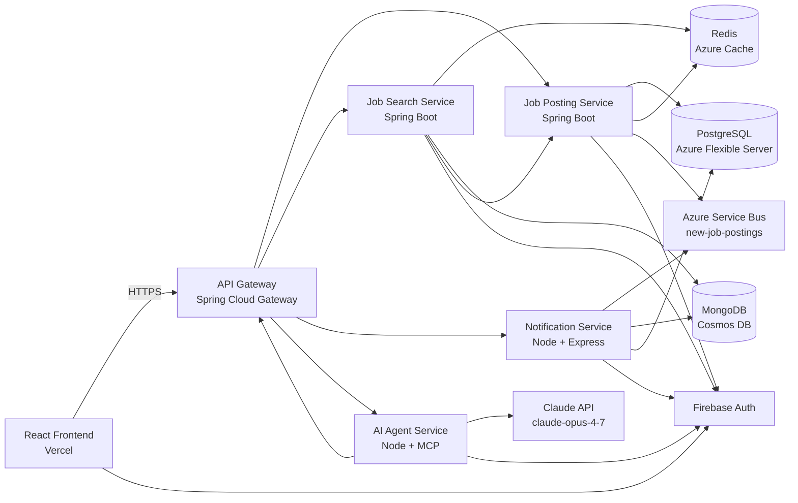
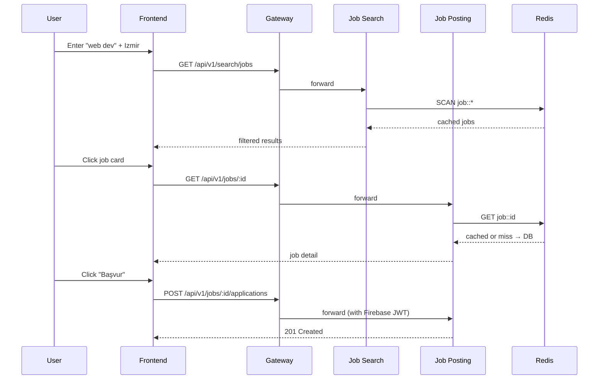
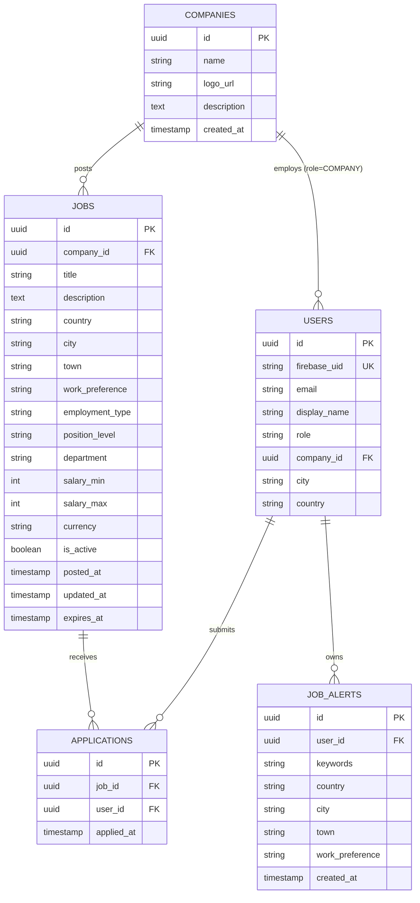
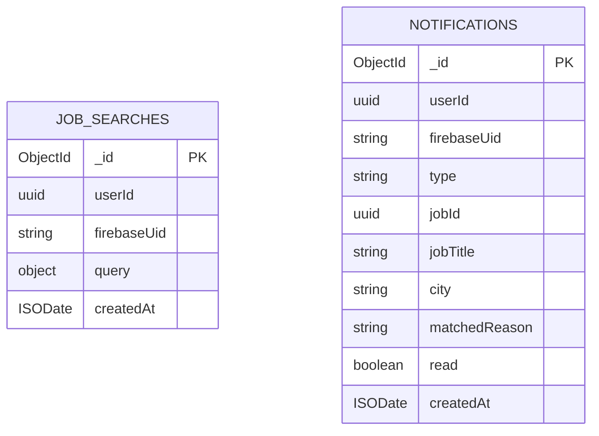

# Job Search Platform

A kariyer.net-style job search platform built as a microservice system for **SE4458 — Software Architecture & Design of Modern Large Scale Systems**, Yaşar University, Spring 2025-2026.

## Live Demo

| Component | URL |
|---|---|
| Frontend | https://frontend-five-fawn-15.vercel.app |
| API Gateway | https://jobsearch-gateway-2107.azurewebsites.net |
| Job Posting API | https://jobsearch-posting-2107.azurewebsites.net |
| Job Search API | https://jobsearch-search-2107.azurewebsites.net |
| Notification API | https://jobsearch-notif-2107.azurewebsites.net |
| AI Agent API | https://jobsearch-agent-2107.azurewebsites.net |

**Demo video:** _to be recorded_

## Team

- Özgür Can Güngör — 21070001058
- Yağız Yungul — _student id_

## Project Overview

The system supports the full job-search workflow:
- Authenticated admins and companies post and manage jobs
- Public search with autocomplete, geolocation-based defaults, and faceted filters
- Job detail pages with related-job recommendations and one-click apply
- Two scheduled background tasks: a job-alert notifier and a related-jobs notifier
- An AI agent chat that performs search and apply through the same APIs

## Architecture



### Sequence: search → detail → apply



## Data Model



Search history (`job_searches`) and notifications (`notifications`) are stored as documents in MongoDB:



## Tech Stack

| Layer | Technology |
|---|---|
| Frontend | React 19 (vanilla JS), Vite, vanilla CSS (glassmorphism) |
| Auth | Firebase Authentication (Email/Password + Google) |
| API Gateway | Spring Cloud Gateway (Java 21) |
| Backend (Java) | Spring Boot 3.3 + Spring Data JPA + Spring Data Redis |
| Backend (Node) | Node 20 + Express + @modelcontextprotocol/sdk + @anthropic-ai/sdk |
| Relational DB | Azure Database for PostgreSQL Flexible Server 16 (with pg_trgm) |
| Cache | Azure Cache for Redis (Basic C0) |
| NoSQL | Azure Cosmos DB (MongoDB API, free tier) |
| Queue | Azure Service Bus (Basic) |
| Hosting | Azure App Service for Containers (backend), Vercel (frontend) |
| Registry | Azure Container Registry |
| CI/CD | GitHub Actions (build, push, deploy, cron) |
| AI Model | Claude Opus 4.7 (claude-opus-4-7) |

## Local Development

```bash
git clone https://github.com/Ozgur492/job-search-platform.git
cd job-search-platform

# 1. Start data services
docker compose up -d postgres redis mongo

# 2. Enable pg_trgm
docker exec -it $(docker ps -qf "ancestor=postgres:16-alpine") \
  psql -U jobsearch -d jobsearch -c "CREATE EXTENSION IF NOT EXISTS pg_trgm;"

# 3. Provide environment files (copy each .env.example to .env and fill in)
# 4. Run each service in its own terminal
cd services/job-posting-service  && mvn spring-boot:run
cd services/job-search-service   && mvn spring-boot:run
cd services/api-gateway          && mvn spring-boot:run
cd services/notification-service && npm install && npm start
cd services/ai-agent-service     && npm install && npm start
cd frontend                      && npm install && npm run dev
```

Frontend: http://localhost:5173 — Gateway: http://localhost:8080 — Swagger: http://localhost:8081/swagger-ui.html

## Project Structure

```
job-search-platform/
├── services/
│   ├── api-gateway/
│   ├── job-posting-service/
│   ├── job-search-service/
│   ├── notification-service/
│   └── ai-agent-service/
├── frontend/
├── infrastructure/
├── docs/
├── scripts/
├── .github/workflows/
└── docker-compose.yml
```

## Design Decisions and Assumptions

- **Service split (Java + Node):** Spring Boot for data-heavy services (Job Posting, Job Search, Gateway), Node for the MCP-based AI Agent and the queue-driven Notification Service. The MCP SDK is best-supported in Node, and matching that with a Node Express layer for cron + queue keeps the project consistent.
- **Authentication:** Firebase Authentication. The brief requires an IAM service; Firebase Auth's free tier covers academic use and JWT verification is one line per request with `firebase-admin`.
- **Distributed cache:** Redis stores each job under `job::{id}` for 5 minutes. The Job Search Service reads via `SCAN` to avoid blocking the cache; on miss it falls back to a REST call.
- **NoSQL stores:** Cosmos DB (Mongo API) holds search history (`job_searches`, TTL 90 days) and notifications (`notifications`). The free tier covers all expected demo traffic.
- **Queue:** Azure Service Bus Basic. Each job creation publishes a message; the Notification Service consumes and matches against the SQL `job_alerts` table.
- **Scheduling:** GitHub Actions cron triggers HTTP endpoints in the Notification Service, protected by a shared `X-Cron-Secret` header. Cheaper and simpler than Azure Logic Apps.
- **AI Agent:** Claude Opus 4.7 with tool use. Five tools (search_jobs, get_job_detail, get_related_jobs, apply_to_job, create_job_alert) are wired through the API Gateway. Anonymous chat works for search; authenticated tools (apply, create alert) require a forwarded Firebase ID token.
- **Geolocation default:** the home page asks for browser geolocation; if denied, defaults to Izmir, consistent with the brief's "assume it is accessible".
- **In-memory conversation store for the agent:** acceptable at this scale. Production would use Redis with a sliding TTL.
- **Frontend stack:** vanilla React + vanilla CSS, not TypeScript + Tailwind, chosen for build speed and bundle size during course-grade demo. Glassmorphism is the design language.
- **No payment, no email/SMS:** brief explicitly relaxes these. Notifications are stored and surfaced in the UI only.

## Known Issues

- Cold start on Azure App Service B1 can take ~30 seconds on the first request after idle. Upgrade to B2 to improve.
- The Job Search Service's autocomplete uses a small in-memory cache rather than a dedicated search index. Latency is acceptable up to a few thousand jobs.
- The AI Agent's conversation memory is per-instance; horizontal scaling would lose context. Documented above as a deliberate trade-off.

## License

MIT — see [LICENSE](./LICENSE).
