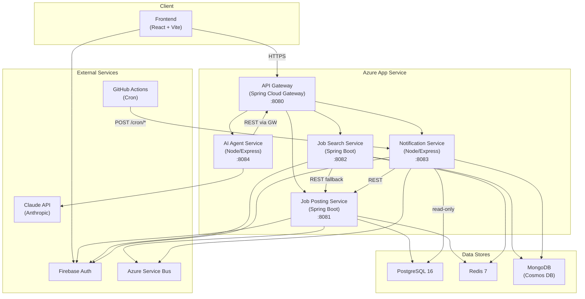
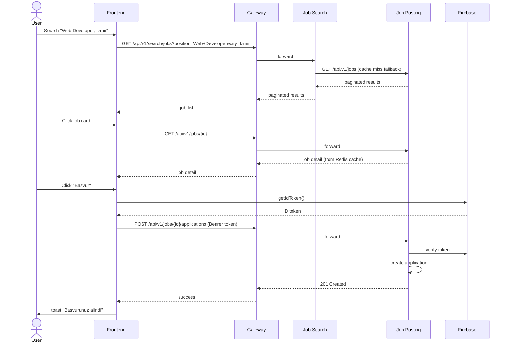
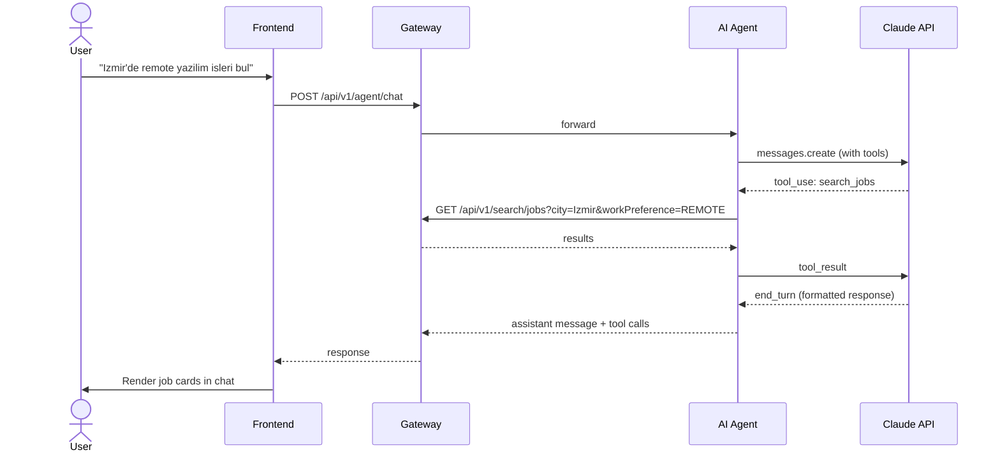

# Architecture

## System Overview

## Service Responsibilities

| Service | Responsibility |
|---|---|
| API Gateway | Routing, CORS, rate limiting, correlation ID |
| Job Posting Service | CRUD for companies, jobs, applications, job alerts |
| Job Search Service | Search, autocomplete, search history |
| Notification Service | Queue consumer, scheduled notifications |
| AI Agent Service | Chat interface with Claude tool use |

## Search-Detail-Apply Flow

## Agent Chat Flow

