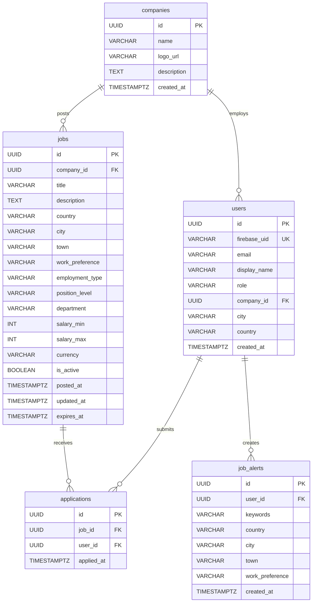

# ER Diagram

## Notes

- `users.role` can be: `USER`, `ADMIN`, or `COMPANY`
- `jobs.work_preference` can be: `ONSITE`, `REMOTE`, or `HYBRID`
- `jobs.employment_type` can be: `FULL_TIME`, `PART_TIME`, `CONTRACT`, or `INTERN`
- `jobs.position_level` can be: `JUNIOR`, `MID`, `SENIOR`, `LEAD`, or `EXPERT`
- `applications` has a unique constraint on `(job_id, user_id)` to prevent duplicate applications
- `users.company_id` is nullable — only set for users with `COMPANY` role

## MongoDB Collections

The following collections exist in MongoDB (not shown in ER diagram):

### `job_searches`
- Stores recent search queries by authenticated users
- TTL index on `createdAt` (90 days auto-prune)

### `notifications`
- Stores job alert and related job notifications
- Types: `JOB_ALERT`, `RELATED_JOB`
